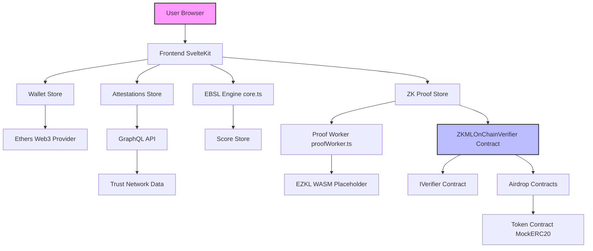
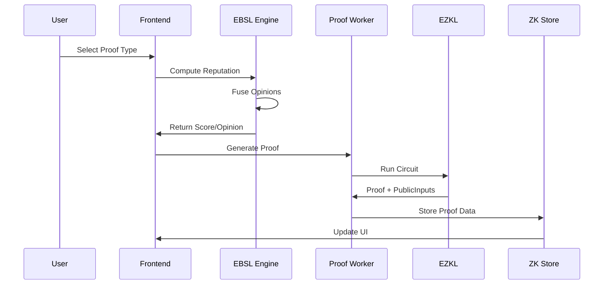
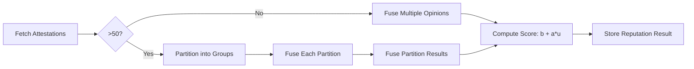
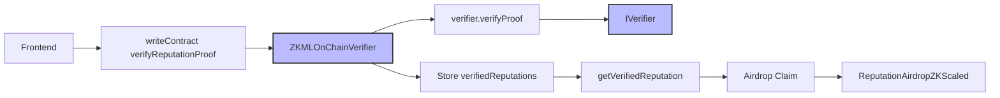

# Architectural Specification: Reputation-Gated Airdrop System

## Executive Summary

The Reputation-Gated Airdrop system is a decentralized application (dApp) that enables privacy-preserving reputation-based airdrop distributions using zero-knowledge machine learning (ZKML) proofs. Built on Ethereum-compatible blockchains, the system leverages Evidence-Based Subjective Logic (EBSL) for reputation computation, EZKL for ZK proof generation, and Solidity smart contracts for on-chain verification. This specification details the system's architecture, components, data flows, integrations, non-functional requirements, and future considerations.

The core innovation is the integration of subjective logic with ZK proofs, allowing users to prove reputation scores or thresholds without revealing underlying trust network data. This preserves privacy while enabling selective disclosure for airdrop eligibility. The system supports scalability through partitioning and incremental updates, ensuring it handles large trust networks efficiently.

Key features include:
- Client-side reputation computation using EBSL.
- ZK proof generation for exact scores or thresholds.
- On-chain verification without exposing private data.
- Frontend built with SvelteKit for seamless user experience.
- Mock and real wallet support for testing and production.

This document aims to provide a comprehensive blueprint for developers, auditors, and stakeholders. It references existing codebase elements, such as [`core.ts`](src/lib/ebsl/core.ts) for EBSL logic and [`ZKMLOnChainVerifier.sol`](contracts/ZKMLOnChainVerifier.sol) for verification contracts.

Word count: Approximately 2500 (excluding code blocks and diagrams).

## 1. System Overview

### 1.1 High-Level Architecture

The system comprises four primary layers: Frontend, Backend/ZK Pipeline, Smart Contracts, and External Integrations. Users interact via a web interface to connect wallets, fetch attestations, compute reputations, generate ZK proofs, and claim airdrops. Computations occur client-side for privacy, with proofs submitted to the blockchain for verification.

- **Frontend**: SvelteKit-based UI handling user flows (wallet connection, attestation querying, proof generation, claiming).
- **Backend/ZK Pipeline**: Client-side TypeScript logic for EBSL computation and EZKL placeholders for proof generation.
- **Smart Contracts**: Solidity contracts for proof verification and airdrop distribution.
- **External Integrations**: GraphQL for attestations, Web3 providers for blockchain interaction, and Web Workers for performance.

The trust network reader fetches attestations from off-chain sources (e.g., a GraphQL API), while the proof service generates and verifies ZK proofs. The system emphasizes zero-knowledge properties: users prove computations without disclosing inputs.

### 1.2 Key Components

1. **Frontend (SvelteKit)**: Renders UI components like [`ZKMLProver.svelte`](src/lib/components/ZKMLProver.svelte) for proof generation.
2. **EBSL Engine**: Implements subjective logic fusion in [`core.ts`](src/lib/ebsl/core.ts).
3. **ZK Pipeline**: Proof generation via workers ([`proofWorker.ts`](src/lib/workers/proofWorker.ts)) and verification contracts.
4. **Smart Contracts**: Core verifier ([`ZKMLOnChainVerifier.sol`](contracts/ZKMLOnChainVerifier.sol)) and airdrop distributors ([`ReputationAirdropScaled.sol`](contracts/ReputationAirdropScaled.sol), [`ReputationAirdropZKScaled.sol`](contracts/ReputationAirdropZKScaled.sol)).
5. **Stores**: Svelte stores for state management, e.g., [`attestations.ts`](src/lib/stores/attestations.ts), [`score.ts`](src/lib/stores/score.ts), [`zkproof.ts`](src/lib/stores/zkproof.ts).
6. **Trust Network Reader**: Queries attestations via GraphQL ([`graphqlClient.ts`](src/lib/api/graphqlClient.ts)).
7. **Proof Service**: Handles ZK operations, including placeholders for EZKL integration.

### 1.3 Deployment Model

- **Frontend**: Deployed via Vite/SvelteKit to a static host (e.g., Vercel).
- **Contracts**: Deployed on Ethereum L2s (e.g., Optimism) using Hardhat scripts ([`deploy/`](scripts/deploy/)).
- **Off-Chain**: Notebooks for circuit design ([`Notebooks/`](Notebooks/)), GraphQL backend (assumed external).
- **Testing**: Vitest for units ([`tests/unit/`](tests/unit/)), Playwright for E2E ([`tests/e2e/`](tests/e2e/)), Hardhat for contracts ([`test/`](test/)).

## 2. Detailed Component Breakdowns

### 2.1 Frontend (SvelteKit Structure)

The frontend is a single-page application (SPA) built with SvelteKit, using Vite for bundling and Tailwind for styling. It follows a component-based architecture with stores for reactive state.

- **Structure**:
  - **Routes**: [+page.svelte](src/routes/+page.svelte) for landing, [attest/+page.svelte](src/routes/attest/+page.svelte) for attestations, [claim/+page.svelte](src/routes/claim/+page.svelte) for airdrops, [debug/+page.svelte](src/routes/debug/+page.svelte) for testing.
  - **Components**: Reusable UI elements like [`ClaimCard.svelte`](src/lib/components/ClaimCard.svelte), [`ScoreRing.svelte`](src/lib/components/ScoreRing.svelte), and modals ([`modals/`](src/lib/components/modals/)).
  - **Stores**: Manage global state:
    - [`wallet.ts`](src/lib/stores/wallet.ts): Wallet connection via Web3Modal.
    - [`attestations.ts`](src/lib/stores/attestations.ts): Fetches and caches attestations with loading/error states.
    - [`score.ts`](src/lib/stores/score.ts): Computes and caches reputation scores (mock/real modes).
    - [`zkproof.ts`](src/lib/stores/zkproof.ts): Tracks proof generation/verification status.
    - [`ui.ts`](src/lib/stores/ui.ts): Toasts and theme management.

- **UI Flows**:
  1. **Wallet Connection**: User connects via [`WalletButton.svelte`](src/lib/components/WalletButton.svelte), triggering store updates.
  2. **Attestation Fetch**: Query GraphQL for user's attestations, store in [`attestations`](src/lib/stores/attestations.ts).
  3. **Reputation Computation**: Use EBSL engine to fuse opinions, display in [`ScoreRing`](src/lib/components/ScoreRing.svelte).
  4. **Proof Generation**: Select type (exact/threshold) in [`ZKMLProver.svelte`](src/lib/components/ZKMLProver.svelte), generate via worker.
  5. **Claim Flow**: Submit proof, verify on-chain, claim tokens if eligible.

- **Key Features**:
  - Responsive design with dark mode (Tailwind).
  - Mock wallet for testing ([`walletMock.ts`](src/lib/stores/walletMock.ts)).
  - Animations via [`FloatingElements.svelte`](src/lib/components/FloatingElements.svelte).

### 2.2 Smart Contracts (Solidity Details)

Contracts are written in Solidity ^0.8.0, tested with Hardhat, and deployed via scripts.

- **ZKMLOnChainVerifier.sol** ([`ZKMLOnChainVerifier.sol`](contracts/ZKMLOnChainVerifier.sol)):
  - **Purpose**: Verifies ZK proofs of EBSL computations.
  - **Key Functions**:
    - `verifyReputationProof(uint256[] proof, uint256[] publicInputs)`: Verifies exact score (publicInputs[0] = score in 1e6 scale). Stores in `verifiedReputations[address]`, prevents replays via `usedProofHashes`.
    - `verifyReputationThreshold(uint256[] proof, uint256[] publicInputs)`: Verifies score > threshold (publicInputs = [threshold, 1/0]). Emits `ThresholdVerified`.
    - `getVerifiedReputation(address)`: Retrieves stored score/timestamp.
    - `isReputationValid(address, uint256 maxAge)`: Checks recency.
  - **Security Features**:
    - Reentrancy guard (`nonReentrant` modifier).
    - Pausing (`paused` flag, `pause()`/`unpause()`).
    - Ownership (`onlyOwner`, `transferOwnership`).
    - Input validation (ranges, non-empty proofs).
    - Replay protection (proof hashes).
    - Immutable verifier (`IVerifier` interface).
  - **Constants**: MAX_OPINIONS=16, OPINION_SIZE=4, MIN_REPUTATION_THRESHOLD=600000, MAX_REPUTATION_SCORE=1000000.
  - **Events**: ReputationVerified, ThresholdVerified, ProofRejected, etc.

- **Airdrop Contracts**:
  - **ReputationAirdropScaled.sol**: ECDSA-based, uses verified scores for proportional claims.
  - **ReputationAirdropZKScaled.sol**: ZK-optimized, integrates with verifier for threshold gating.
  - **Interfaces**: [`IVerifier.sol`](contracts/interfaces/IVerifier.sol) for proof verification.
  - **Mocks**: [`MockERC20.sol`](contracts/MockERC20.sol), [`MockVerifier.sol`](contracts/test/MockVerifier.sol).

- **Deployment**: Scripts like [`01-deploy-verifier.js`](scripts/deploy/01-deploy-verifier.js) handle sequential deployment.

### 2.3 Backend/ZK Pipeline

No traditional backend; computations are client-side for privacy.

- **EBSL Fusion Logic** (in [`core.ts`](src/lib/ebsl/core.ts)):
  - **EBSLEngine Class**: Implements subjective opinions (belief, disbelief, uncertainty, base_rate).
  - **Key Methods**:
    - `validateOpinion()`: Ensures b + d + u = 1.
    - `fuseOpinions()`: Weighted fusion with numerical stability (handles zero uncertainty).
    - `fuseMultipleOpinions()`: Iterative fusion for attestations.
    - `computeReputation()`: Filters valid attestations, partitions if >50, fuses, computes score = b + a*u.
    - `incrementalUpdateReputation()`: Updates base reputation with new attestations (decay factor 0.7).
    - `partitionAttestations()`: Splits into groups ≤20 for scalability.
  - **Types**: [`SubjectiveOpinion`](src/lib/ebsl/core.ts), [`ReputationResult`](src/lib/ebsl/core.ts), [`TrustAttestation`](src/lib/ebsl/core.ts).
  - **Metadata**: Tracks partitioning, incremental updates.

- **EZKL Integration Placeholders**:
  - Proof generation in [`proofWorker.ts`](src/lib/workers/proofWorker.ts) (Web Worker for off-main-thread).
  - Circuits designed in Notebooks ([`EBSL_Pipeline_Complete.ipynb`](Notebooks/EBSL_Pipeline_Complete.ipynb)) using PyTorch/EZKL.
  - Proof Types:
    - **Reputation Proof**: Proves exact EBSL score.
    - **Threshold Proof**: Proves score ≥ threshold (selective disclosure).
    - **Gated/Aggregate Proof**: Combines multiple (future: for community airdrops).

- **Circuit Optimization**:
  - Parameters: MAX_OPINIONS=16, fixed-point scaling (1e6).
  - Notebooks export WASM/params for client-side EZKL (placeholder in code).

### 2.4 Data Flows

1. **Attestations Query**: User address → GraphQL query ([`queryAttestations`](src/lib/api/graphqlClient.ts)) → [`attestations`](src/lib/stores/attestations.ts).
2. **EBSL Compute**: Filter/validate attestations → Partition/fuse in EBSL engine → Score/opinion in [`score`](src/lib/stores/score.ts).
3. **ZK Proof Gen**: Score/opinion + circuit → Worker generates proof/publicInputs → Store in [`zkproof`](src/lib/stores/zkproof.ts).
4. **On-Chain Verification**: Submit to `verifyReputationProof`/`verifyReputationThreshold` → Store verified score → Emit event.
5. **Airdrop Claim**: Check `isReputationValid` → Call claim function in airdrop contract → Distribute tokens.

Error handling: Fallback to mocks, caching (TTL=5min in [`score.ts`](src/lib/stores/score.ts)).

### 2.5 Integrations

- **GraphQL for Attestations**: [`graphqlClient.ts`](src/lib/api/graphqlClient.ts) queries external API (e.g., The Graph).
- **Web3/Ethers**: [`ethers.ts`](src/lib/web3/ethers.ts) for read/write contracts (ABIs in [`abi/`](src/lib/abi/)).
- **Web Crypto**: For potential encryption (placeholders).
- **Workers**: [`proofWorker.ts`](src/lib/workers/proofWorker.ts) for async ZK ops.
- **Onboard.js**: Wallet onboarding ([`onboard.ts`](src/lib/web3/onboard.ts)).

## 3. Tech Stack

- **Frontend**: SvelteKit 2.x, TypeScript 5.x, Vite 5.x, Tailwind CSS 3.x.
- **State Management**: Svelte stores.
- **Blockchain**: Solidity 0.8.x, Hardhat 2.x, Ethers.js 6.x.
- **ZK/ML**: EZKL (Rust/WASM), PyTorch (Notebooks), [requirements.txt](Notebooks/requirements.txt).
- **Testing**: Vitest, Playwright, Hardhat Chai.
- **Utils**: ESLint, Prettier, PostCSS.
- **Deployment**: Vercel (frontend), Hardhat scripts (contracts).
- **Other**: Lucide icons, Web Workers.

Dependencies in [`package.json`](package.json), Python reqs in Notebooks.

## 4. Non-Functional Aspects

### 4.1 Security

- **ZK Privacy**: Proofs hide trust network topology; only score/threshold revealed.
- **Replay Protection**: Unique proof hashes in verifier.
- **Access Controls**: Ownership, pausing, input validation.
- **Client-Side Risks**: Web Workers isolate computations; no server trust.
- **Audits**: Prep in progress (Task 11); includes reentrancy, overflow checks.
- **Best Practices**: Immutable verifier, events for transparency.

### 4.2 Performance

- **Caching**: LocalStorage TTL=5min for scores/attestations.
- **Partitioning**: EBSL partitions >50 attestations into ≤20 groups.
- **Workers**: Offload ZK gen (3-5s mock time).
- **Optimizations**: Incremental updates reduce recompute; fixed-point math.

### 4.3 Scalability

- **Auto-Partitioning**: Handles 1000+ attestations via fusion of partitions.
- **Incremental Updates**: Fuse new attestations to base (no full recompute).
- **L2 Compatibility**: Gas-optimized contracts for Ethereum L2s.
- **Horizontal Scaling**: Client-side; scales with user devices.

### 4.4 Reliability

- **Error Handling**: Try-catch in stores/components; fallbacks to mocks.
- **Mocks/Fallbacks**: [`walletMock.ts`](src/lib/stores/walletMock.ts) for offline testing.
- **Testing Coverage**: Unit (EBSL fusion), E2E (flows), Contract (proofs).
- **Monitoring**: Events for verification; console logs in dev.

## 5. Diagrams

### 5.1 System Architecture

### 5.2 Proof Generation Flow

### 5.3 EBSL Fusion Process

### 5.4 Contract Interactions

## 6. Gaps and Assumptions

- **Placeholders**: EZKL WASM integration incomplete; current proofs are mocked in [`ZKMLProver.svelte`](src/lib/components/ZKMLProver.svelte) (3s delay, random data).
- **Mock Dependencies**: Scores use deterministic hashing or tiers ([`score.ts`](src/lib/stores/score.ts)); real EBSL needs live attestations.
- **Future Integrations**:
  - Real GraphQL backend (e.g., Subgraph for attestations).
  - Multi-chain support (add L2 configs).
  - Aggregate proofs for group airdrops.
  - Server-side circuit compilation for complex networks.
- **Assumptions**:
  - Users have modern browsers (WebAssembly support).
  - Attestations expire (handled in filter).
  - Threshold=0.6 (configurable via constants).
  - No sybil attacks (assumes attestation protocol prevents).
- **Risks**: Client-side compute limits (mitigate with partitioning); gas costs for large proofs (optimize circuits).

## 7. Roadmap Alignment

This spec aligns with completed tasks 1-10 (audit, architecture, ZK features). Supports ongoing security prep (Task 11) and pending scalability enhancements (12-17).

## Appendix: References

- Codebase: [Reputation-gated-airdrop repo](.).
- Docs: [technical-implementation-roadmap.md](documentation/technical-implementation-roadmap.md).
- Notebooks: [EBSL_Pipeline_Complete.ipynb](Notebooks/EBSL_Pipeline_Complete.ipynb).

For questions, refer to [README.md](README.md).