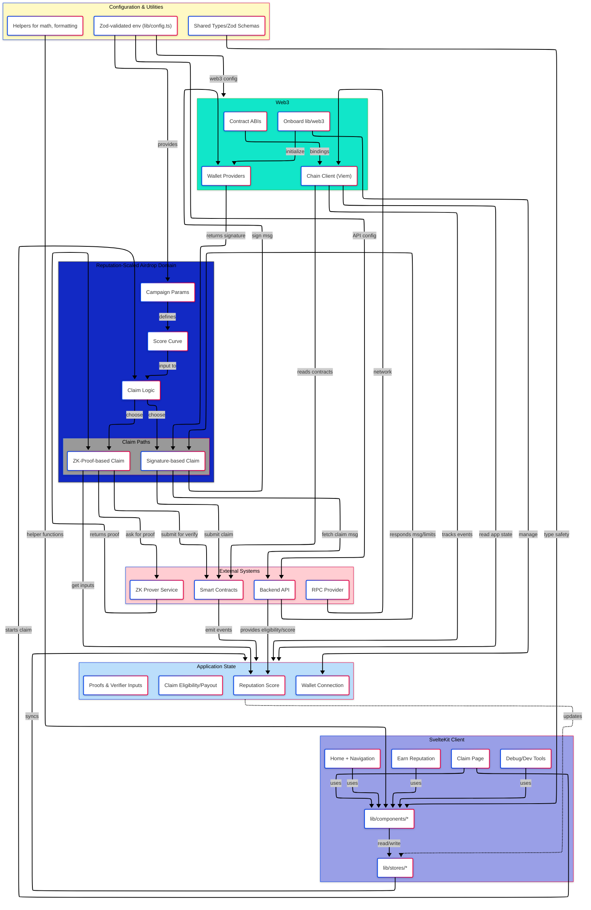

```mermaid
---
config:
  layout: elk
  theme: neo
  look: neo
---
flowchart TB
 subgraph Config["Configuration & Utilities"]
        Env("Zod-validated env (lib/config.ts)")
        Types("Shared Types/Zod Schemas")
        Utils("Helpers for math, formatting")
  end
 subgraph Client["SvelteKit Client"]
        UI_Home("Home + Navigation")
        UI_Claim("Claim Page")
        UI_Earn("Earn Reputation")
        UI_Debug("Debug/Dev Tools")
        Components("lib/components/*")
        Stores("lib/stores/*")
  end
 subgraph Web3["Web3"]
        Onboard("Onboard lib/web3")
        ChainClient("Chain Client (Viem)")
        ABI("Contract ABIs")
        Wallets("Wallet Providers")
  end
 subgraph Paths["Claim Paths"]
        ECDSA("Signature-based Claim")
        ZK("ZK-Proof-based Claim")
  end
 subgraph Airdrop["Reputation-Scaled Airdrop Domain"]
        Params("Campaign Params")
        Scoring("Score Curve")
        ClaimLogic("Claim Logic")
        Paths
  end
 subgraph External["External Systems"]
        RPC("RPC Provider")
        Contracts("Smart Contracts")
        Backend("Backend API")
        Prover("ZK Prover Service")
  end
 subgraph State["Application State"]
        WalletState("Wallet Connection")
        ScoreState("Reputation Score")
        ClaimState("Claim Eligibility/Payout")
        ProofState("Proofs & Verifier Inputs")
  end
    UI_Home -- uses --> Components
    UI_Claim -- uses --> Components
    UI_Earn -- uses --> Components
    UI_Debug -- uses --> Components
    Components -- read/write --> Stores
    Stores -- syncs --> State
    State -. updates .-> Stores
    Env -- provides --> Params
    Env -- web3 config --> Web3
    Env -- API config --> Backend
    Utils -- helper functions --> Components
    Types -- type safety --> Components
    UI_Claim -- starts claim --> ClaimLogic
    ClaimLogic -- choose --> ECDSA & ZK
    ECDSA -- fetch claim msg --> Backend
    Backend -- responds msg/limits --> ECDSA
    ECDSA -- sign msg --> Wallets
    Wallets -- returns signature --> ECDSA
    ECDSA -- submit claim --> Contracts
    ZK -- get inputs --> ScoreState
    ZK -- ask for proof --> Prover
    Prover -- returns proof --> ZK
    ZK -- submit for verify --> Contracts
    Params -- defines --> Scoring
    Scoring -- input to --> ClaimLogic
    ChainClient -- reads contracts --> Contracts
    ChainClient -- tracks events --> State
    ABI -- bindings --> ChainClient
    Onboard -- initialize --> Wallets
    Onboard -- manage --> WalletState
    Contracts -- emit events --> State
    Backend -- provides eligibility/score --> ScoreState
    ChainClient -- read app state --> State
    RPC -- network --> ChainClient
    classDef layer fill:#0b3,stroke:#083,stroke-width:1,color:#fff
    classDef external fill:#444,stroke:#222,stroke-width:1,color:#fff
    classDef domain fill:#630,stroke:#420,stroke-width:1,color:#fff
    style Paths fill:#999
    style State fill:#BBDEFB,color:#000000
    style Web3 fill:#11E6C9,color:#000000,stroke:#00C853, border-radius: 5px
    style Config fill:#FFF9C4
    style Client fill:#999FE7
    style Airdrop fill:#1229C4,stroke:#424242
    style External fill:#FFCDD2
```
