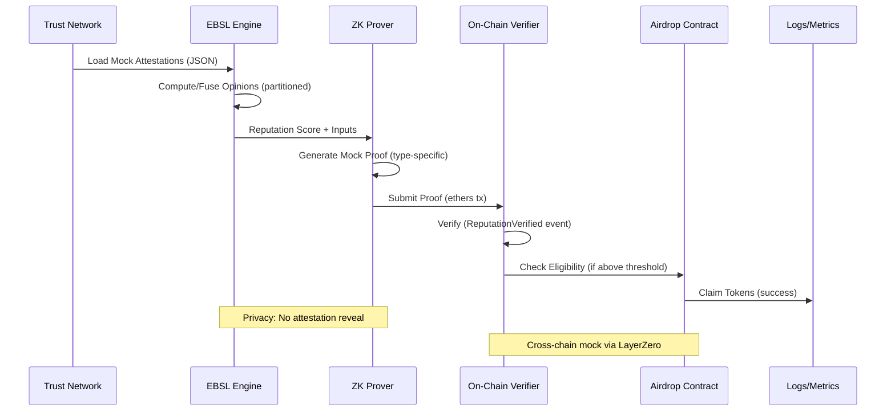

# E2E Demo Guide: Reputation-Gated Airdrop with ZK Proofs

This guide outlines a comprehensive end-to-end (E2E) demo for the Reputation-Gated Airdrop system, demonstrating ZK proof creation and verification for arbitrary trust networks. The demo simulates the full flow from mock trust network data to on-chain verification using local Hardhat setup. It focuses on privacy-preserving reputation proofs (threshold, gated, anonymous, set membership) without revealing underlying attestations.

The demo is designed to be CLI-based, standalone, and configurable for different trust networks (e.g., small/large, anonymous, cross-chain mocks). It references existing components like EBSL computation in [`core.ts`](src/lib/ebsl/core.ts), ZK verification in [`ZKMLOnChainVerifier.sol`](contracts/ZKMLOnChainVerifier.sol), and deployment scripts.

## Prerequisites

Before running the demo, ensure the following local setup:

1. **Environment Setup**:
   - Node.js (v18+), Yarn/NPM, Hardhat, TypeScript.
   - Install dependencies: `yarn install` (or `npm install`).
   - Clone the repo: `/Users/oli/code/Reputation-gated-airdrop`.
   - Set up `.env` with local RPC (e.g., `VITE_RPC_URL=http://localhost:8546`).

2. **Local Blockchain**:
   - Start Hardhat node in background: `npx hardhat node --port 8546 &` (runs on `http://localhost:8546` to avoid port conflicts; use `sleep 5` after to ensure ready).
   - Deploy contracts: `VITE_RPC_URL=http://localhost:8546 ./scripts/deploy/deploy-contracts.sh localhost 8546` (deploys Verifier, ZKMLOnChainVerifier, Airdrop contracts; outputs addresses to deployed-addresses.json and logs).

3. **Mock Wallet**:
   - Use Hardhat accounts (e.g., private key from node output: `0xac0974bec39a17e36ba4a6b4d238ff944bacb478cbed5efcae784d7bf4f2ff80` for account `0xf39Fd6e51aad88F6F4ce6aB8827279cffFb92266`).
   - Configure in demo script: `const wallet = new ethers.Wallet(PRIVATE_KEY, provider);`.

4. **Arbitrary Trust Network Data**:
   - Create JSON file (e.g., `mock-data.json`) with attestations:
     ```json
     {
       "userAddress": "0xf39Fd6e51aad88F6F4ce6aB8827279cffFb92266",
       "attestations": [
         {
           "source": "0x70997970C51812dc3A010C7d01b50e0d17dc79C8",
           "target": "0xf39Fd6e51aad88F6F4ce6aB8827279cffFb92266",
           "opinion": { "belief": 0.8, "disbelief": 0.1, "uncertainty": 0.1, "base_rate": 0.5 },
           "attestation_type": "trust",
           "weight": 1.0,
           "created_at": 1690000000000,
           "expires_at": 1720000000000
         }
         // Add more for varying networks (e.g., 10 for small, 100+ for large)
       ],
       "community": "dev-community",
       "chainId": 31337 // Local Hardhat
     }
     ```
   - For anonymous/cross-chain: Include Semaphore group ID (e.g., 1) and LayerZero mock endpoints.

5. **Tools**:
   - Ethers.js for interactions.
   - TypeScript/Node for script execution (`ts-node`).
   - Mock ZK proofs (placeholders for EZKL/Semaphore; use dummy arrays in script).

Ensure all tests pass: `yarn test` (unit/E2E coverage >85%).

## High-Level Flow

The demo follows this 6-step E2E process, simulating frontend logic in CLI:

1. **Deploy Contracts Locally**:
   - Use [`deploy-contracts.sh`](scripts/deploy/deploy-contracts.sh) to deploy on Hardhat.
   - Verify addresses: ZKMLOnChainVerifier (for proofs), ReputationAirdropZKScaled (for claims).
   - Output: Contract ABIs loaded via [`ethers.ts`](src/lib/web3/ethers.ts).

2. **Simulate Trust Network**:
   - Load mock attestations from JSON via [`graphqlClient.ts`](src/lib/api/graphqlClient.ts) or direct file read.
   - Generate varying data: Small network (10 attestations), large (100+ with partitioning), anonymous (Semaphore signals), cross-chain (mock Polygon endpoints).
   - Cache in memory (inspired by [`attestations.ts`](src/lib/stores/attestations.ts)).

3. **Compute EBSL Score**:
   - Use [`EBSLEngine`](src/lib/ebsl/core.ts): `computeReputation` or `incrementalUpdateReputation` with partitioning for large sets.
   - Fuse opinions: `fuseOpinions`/`fuseMultipleOpinions` handling weights/uncertainty.
   - Output: `ReputationResult` (score 0-1, opinion, confidence); log metadata (partitioned/incremental).

4. **Generate ZK Proof**:
   - Simulate [`ZKMLProver.svelte`](src/lib/components/ZKMLProver.svelte) logic in Node/CLI.
   - Types:
     - Reputation: Exact score proof (publicInputs: [score]).
     - Threshold: Above-threshold (publicInputs: [threshold, 1]).
     - Gated/Anonymous: Semaphore (`verifyAnonymousCredential`).
     - Set: Membership (`computeSetMembershipInputs` → `verifySetMembership`).
   - Mock EZKL/Groth16: Dummy proof arrays; include community/chain in inputs.
   - Worker simulation: Use [`proofWorker.ts`](src/lib/workers/proofWorker.ts) for async.

5. **On-Chain Verification**:
   - Use ethers: Call `verifyReputationProof`/`verifyReputationThreshold`/`verifyAnonymousCredential`/`verifySetMembership` on ZKMLOnChainVerifier.
   - Inputs: Mock proof/publicInputs; sign/send tx via wallet.
   - Check: Events (`ReputationVerified`), `getVerifiedReputation` (score/timestamp), eligibility in Airdrop contract.
   - Handle tx: Gas estimates, wait for confirmation.

6. **Metrics/Logging**:
   - Use [`analytics.ts`](src/lib/stores/analytics.ts): Track timings (EBSL compute, proof gen, tx).
   - Sentry mocks: `Sentry.captureException` for errors (e.g., invalid proof).
   - Output: Console logs, JSON summary (success/fail, metrics).

## Script Structure

Propose a standalone TS script: `scripts/demo/run-e2e-zk-demo.ts`. Structure:

- **Imports**: Ethers, EBSLEngine, ABIs, fs for JSON.
- **Config**: CLI args (yargs): `--network localhost`, `--attestations mock-data.json`, `--proof-type reputation|threshold|anonymous|set`, `--community dev-community`.
- **Main Function**:
  1. Parse args, load JSON attestations.
  2. Connect provider/wallet (Hardhat RPC).
  3. Deploy/attach contracts (use deployed addresses or redeploy).
  4. Step 2: Simulate network (filter valid attestations).
  5. Step 3: Compute EBSL score (handle partitioning/incremental).
  6. Step 4: Generate mock proof (type-specific inputs).
  7. Step 5: Verify on-chain (call contract, wait tx, check events).
  8. Step 6: Log metrics (timings, errors).
- **Helpers**:
  - `generateMockProof(type: string, inputs: any)`: Return dummy proof/publicInputs.
  - `logMetrics(start: number, end: number, step: string)`: Console/JSON output.
- **Error Handling**: Try-catch, retry tx, validate opinions.
- **Output**: JSON summary (`demo-results.json`), console (colored logs).

Example CLI: `npx ts-node --esm scripts/demo/run-e2e-zk-demo.ts --rpc-url http://localhost:8546 --attestations scripts/demo/mock-data.json --proof-type threshold`.

Do not implement yet; this is for reference in Code mode.

## Edge Cases

Demo these variations for robustness:

- **Varying Networks**:
  - Small: 10 attestations → No partitioning.
  - Large: 100+ → Partitioning (`partitionAttestations` in core.ts).
  - Anonymous: Semaphore signals (no source reveal).
  - Cross-Chain: Mock Polygon (chainId 137, LayerZero endpoints).

- **Negatives**:
  - Invalid Proof: Wrong publicInputs → `ProofRejected` event.
  - Low Score: <0.6 → Fails threshold, logs ineligibility.
  - Replay: Same proofHash → Reverts (`usedProofHashes`).
  - Expired Attestations: Filter out → Lower score/confidence.
  - Errors: Invalid opinion → Validation fail in `validateOpinion`.

Run via script flags: `--edge-case large|invalid|replay`.

## Tools/Commands

- **Run Steps** (Fail-Safe Sequential Pipeline):
  Run these commands sequentially in the project root (`/Users/oli/code/Reputation-gated-airdrop`):
  1. pkill -f 'hardhat node' || true
  2. npx hardhat node --port 8546 & PID=$!
  3. sleep 15
  4. curl -s -X POST -H "Content-Type: application/json" --data '{"jsonrpc":"2.0","method":"eth_blockNumber","params":[],"id":1}' http://localhost:8546 | tee /tmp/rpc.log | grep result || (echo "RPC not ready – check /tmp/rpc.log"; sleep 15; curl -s -X POST -H "Content-Type: application/json" --data '{"jsonrpc":"2.0","method":"eth_blockNumber","params":[],"id":1}' http://localhost:8546 | tee -a /tmp/rpc.log | grep result)
  5. PORT=8546 VITE_RPC_URL=http://localhost:8546 ./scripts/deploy/deploy-contracts.sh localhost
  6. if [ -f deployed-addresses.json ]; then cat deployed-addresses.json; else echo "Deploy failed – manual run npx hardhat run scripts/deploy/01-deploy-verifier.cjs --network localhost --url http://localhost:8546"; fi
  7. NODE_NO_WARNINGS=1 npx ts-node --esm scripts/demo/run-e2e-zk-demo.ts --rpc-url http://localhost:8546 --deploy false --proof-type exact
  8. Other variants (repeat steps 1-6 if needed, then step 7 with flags):
     - Threshold: `--proof-type threshold`
     - Anonymous: `--proof-type anonymous --anonymous true`
     - Large network: `--edge-case large`
     - Invalid proof: `--edge-case invalid`
     - Replay attack: `--proof-type anonymous --edge-case replay --anonymous true`
     - Low score: `--edge-case low`
     - With deploy: `--deploy true` (re-deploys before demo)
     - Clean up node: `--kill-node true` (kills hardhat node at end)
  9. Stop node manually if needed: `pkill -f "hardhat node --port 8546"` or `kill $PID` (from step 2).

- **Verify Steps**:
  - Check console for timings (EBSL >0ms, proof gen >0ms, tx >0ms), score (>0.6 eligible), success (✅), no path/assertion errors.
  - Tx/events: In Hardhat console (`npx hardhat console --network localhost`), query `await contract.getVerifiedReputation("0xf39Fd6e51aad88F6F4ce6aB8827279cffFb92266")` for score/timestamp.
  - Metrics JSON: `demo-results.json` (full summary with config/timings/errors).
  - Linting/tests: `yarn lint` and `yarn test` pass without errors.

- **Output Verification**:
  - Logs: Timings, scores, events (e.g., `ReputationVerified`).
  - Tx: Success hash, gas used.
  - JSON: `demo-results.json` (score, proofHash, metrics).
  - Contract: `npx hardhat console --network localhost` → `await contract.getVerifiedReputation(user)`.

Inspired by [`comprehensive-demo.spec.ts`](tests/e2e/comprehensive-demo.spec.ts) for flow validation.

## Integration

- **Existing Components**:
  - Deploy: Extend [`deploy-contracts.sh`](scripts/deploy/deploy-contracts.sh) for local.
  - EBSL: Direct use of [`core.ts`](src/lib/ebsl/core.ts) functions.
  - ZK: Mock calls to [`ZKMLOnChainVerifier.sol`](contracts/ZKMLOnChainVerifier.sol) methods.
  - Stores: Simulate [`score.ts`](src/lib/stores/score.ts), [`attestations.ts`](src/lib/stores/attestations.ts) in CLI.
  - Tests: Draw from E2E specs (e.g., privacy/zkml-frontend.spec.ts) for assertions.

- **Standalone**: No browser/Svelte needed; CLI simulates frontend (e.g., no WalletConnect, use ethers Wallet).
- **Extensibility**: Configurable JSON for arbitrary networks; add real EZKL later.

## Flow Diagram



This diagram shows the core sequence: trust network → EBSL score → ZK proof → on-chain verify → claim.

For implementation, switch to Code mode to create `run-e2e-zk-demo.ts` and refine mocks.
